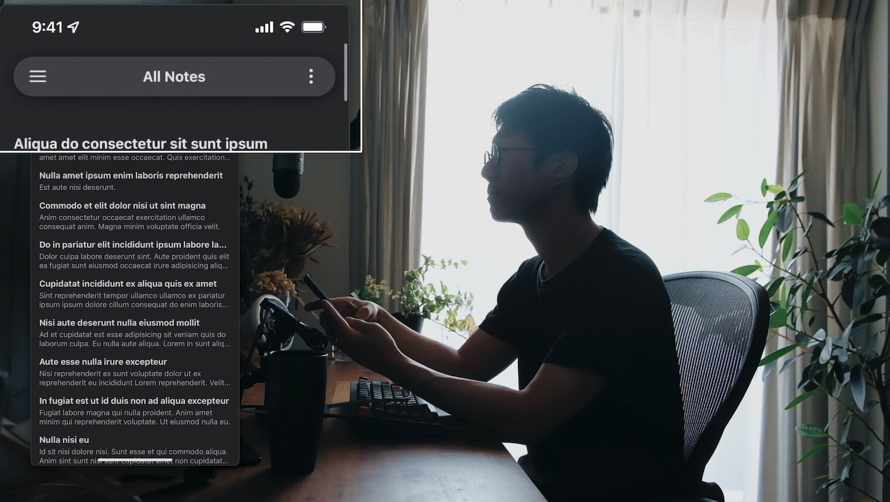
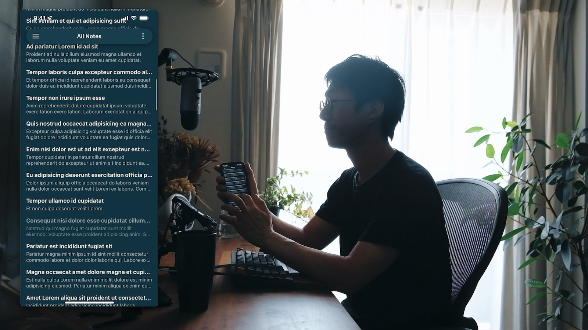
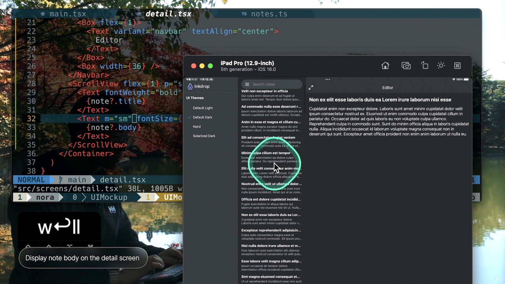

# Gmail-like UI with React Native

A UI mockup for the new version of [Inkdrop](https://www.inkdrop.app/) for mobile, inspired by Gmail for iOS and Android.

## Features

- Sticky header bar
- Swipe-able list item
- Bottom action sheet
- Multiple theme support
- Tablet screen support

Note: Web is not supported







## Video Tutorial

- Part 1: [How to build Gmail-like UI with React Native](https://www.youtube.com/watch?v=w-M9UFHLAl0)
- Part 2: [How to implement responsive three-column layout with React Native](https://www.youtube.com/watch?v=JU4VBbe23jg)

## Stack

- [TypeScript](https://www.typescriptlang.org/) - JavaScript with syntax for types
- [React Native](https://reactnative.dev/) - ReactJS-based framework that can use native platform capabilities
- [React Navigation(v6)](https://reactnavigation.org/) - Routing and navigation
- [Restyle](https://github.com/Shopify/restyle) - A type-enforced system for building UI components
- [React Native Reanimated](https://docs.swmansion.com/react-native-reanimated/) - Animations
- [React Native SVG](https://github.com/react-native-svg/react-native-svg) - Displaying SVG images
- [React Native Vector Icons](https://github.com/oblador/react-native-vector-icons) - Free Icons
- [React Native Bottom Sheet](https://github.com/gorhom/react-native-bottom-sheet) - A performant interactive bottom sheet with fully configurable options
- [jotai](https://jotai.org/) - Primitive and flexible state management for React
- [React Native Three-Column Layout](https://github.com/craftzdog/react-native-three-column-layout) - A React component providing a three-column layout with animation support for tablet displays

## Project structure

```
$PROJECT_ROOT
├── index.js       # Entry point
└── src
    ├── navs.tsx   # Navigation components
    ├── atoms      # Atomic components
    ├── components # UI components
    ├── screens    # Screen components
    ├── hooks      # hooks
    ├── states     # Jotai atoms
    ├── fixtures   # sample data
    └── images     # Image files
```

## How to dev

This project can be run from the Expo client app.

```sh
yarn
yarn start
```

and in another terminal:

```sh
yarn run ios
# or
yarn run android
```

## License

Apache-2.0

---

Looking for a Markdown note-taking app? Check out my app called Inkdrop:

[](https://www.inkdrop.app/)
